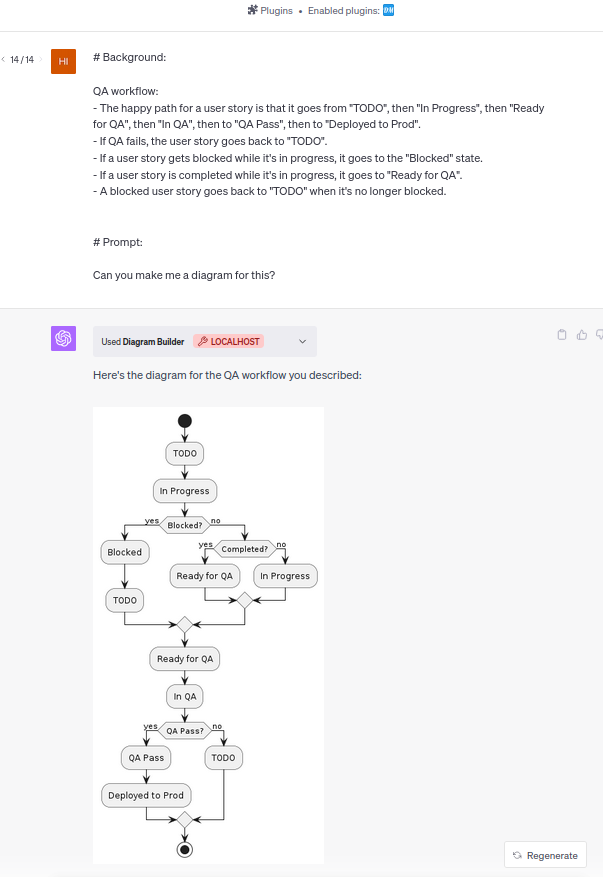

# PlantUML Plugin for ChatGPT. 

Makes [PlantUML](https://plantuml.com) diagrams. 

How it works: 

- ChatGPT generates text in PlantUML notation and posts it to the plugin's API. 
- The API returns a link to a statically hosted PNG file with the PlantUML diagram. 
- ChatGPT downloads the PNG file and displays it.

## Example:



As you can see, the results are somewhat hit and miss, depending on the prompt. It's best to iterate and maybe use the the generated PlantUML as a starting point for manual editing.   You can get the PlantUML text by using a ```Can you show me the PlantUML you generated for this?``` prompt. Syntax errors happen occasionally. I've had reasonably good luck with asking ChatGPT to fix them.

OpenAPI spec: [openapi.yaml](openapi.yaml)

 ## HOWTO

### Run the API in a Docker container

```
 docker build -t chatgpt-plugin-plantuml .
 docker run -p 5003:5003 chatgpt-plugin-plantuml
 ```
This exposes the API on port 5003 on localhost. To use the plugin: Follow the instructions in the [OpenAI Plugin documentation](https://platform.openai.com/docs/plugins/getting-started/running-a-plugin).

 ### Run the API locally

 1. Ensure you have Python: ```python --version``` . Install it if necessary.
 2. Install Java. To check if you have it already: ```java --version``` Java is needed to generate .png images from PlantUML.
 3. Download the plantuml.jar: ```wget "https://sourceforge.net/projects/plantuml/files/plantuml.jar/download" -O plantuml.jar```
 4. Run ```python main.py```
 5. Follow the instructions in the [OpenAI Plugin documentation](https://platform.openai.com/docs/plugins/getting-started/running-a-plugin) on how to use a plugin running on localhost.

 ### Test the API

 ```
curl --location --request POST 'http://localhost:5003/generate-diagram' \
--header 'Content-Type: application/json' \
--data-raw '{
  "umlCode": "@startuml\nstart\n:Initialize;\n:Process Data;\nif (Is Valid?) then (yes)\n  :Continue Processing;\nelse (no)\n  :Stop;\nendif\n:Finalize;\nstop\n@enduml"
}'
```

To view the generated diagram: E.g. ```eog output.png``` or any other image viewer/editor.


